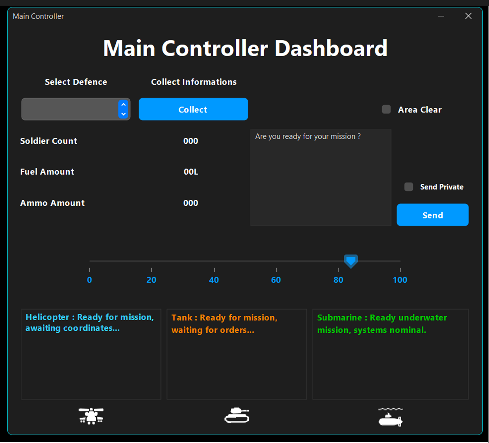
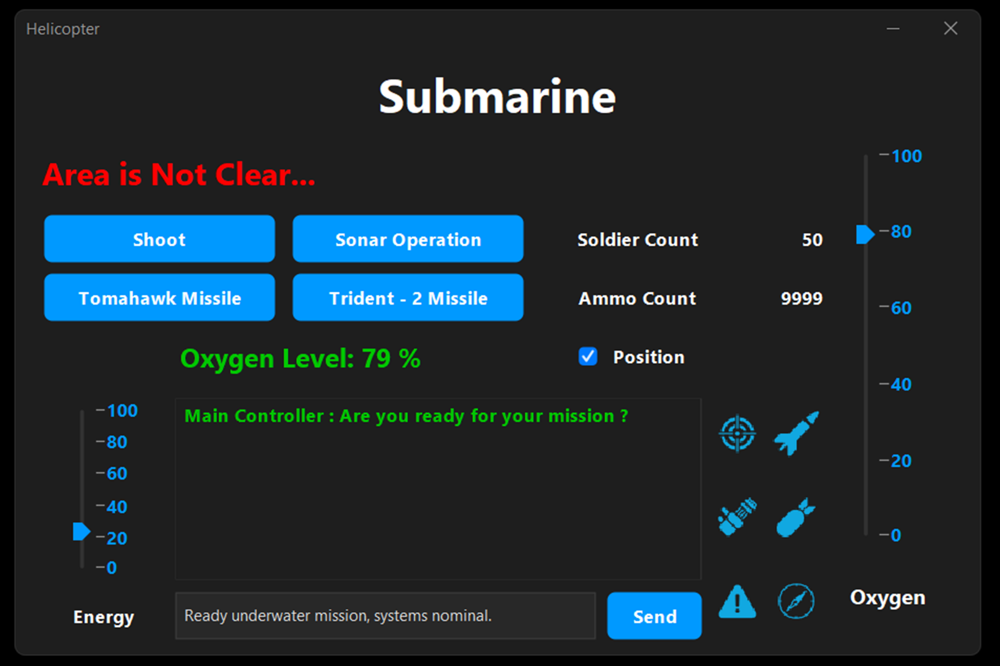
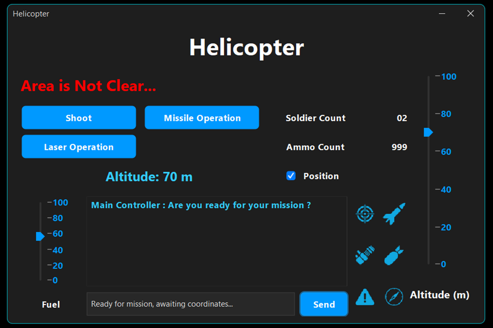
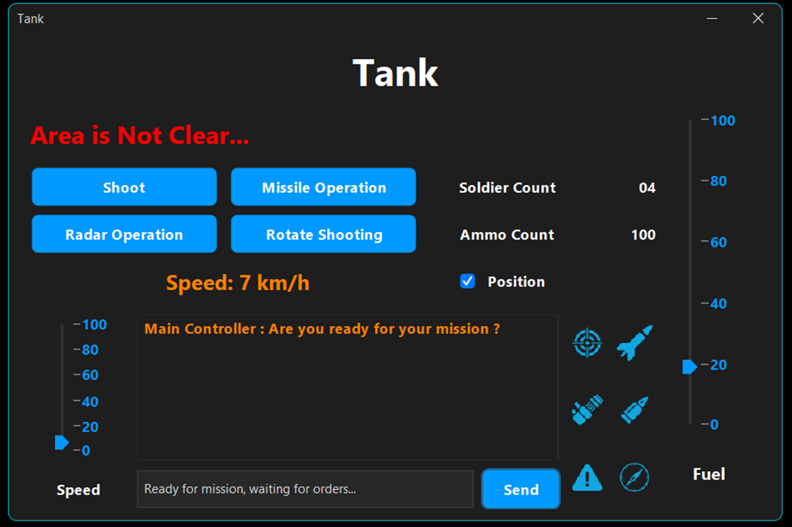

# 🛰️ Defence Mission Control System  
**Real-Time Java OOP + Swing Simulation Project**


---

## 🚀 Overview  

The **Defence Mission Control System** is a futuristic simulation built using **Java OOP** and **Swing GUI**, demonstrating **real-time coordination** between multiple defence units — 🛩 *Helicopter*, 🚜 *Tank*, and 🛳 *Submarine* — all connected through a **Main Controller Dashboard** using the **Observer Design Pattern**.

---

## 🎯 Project Highlights  

✨ **Real-Time Communication** between controller and units  
✨ **Observer Pattern Implementation** for event broadcasting  
✨ **Dynamic Simulations** (Altitude, Fuel, Oxygen, Radar)  
✨ **Auto Mission Replies** — units reply intelligently to commands  
✨ **Modern FlatLaf Dark UI** with styled messages  

---

## 🧠 Tech Stack  

| Category | Technology |
|-----------|-------------|
| 💻 Language | Java 17 (OOP) |
| 🎨 UI Framework | Swing |
| 🧩 Design Pattern | Observer Pattern |
| 🧱 Architecture | MVC-based Event Handling |
| 🌈 Styling | FlatLaf Mac Dark Theme |
| 🕹 Animations | javax.swing.Timer |

---

## 🖼️ Sample Screenshots  

| Main Controller | Helicopter | Tank | Submarine |
|------------------|------------|------|------------|
|  |  |  |  |

---

## 🧩 How It Works  

### 🛰 Main Controller  
- Sends mission commands to all connected units.  
- Broadcasts area status (`Clear` / `Not Clear`).  
- Receives real-time unit replies and logs.  

### 🚁 Helicopter  
- Auto altitude adjustment (timer-based).  
- Fuel consumption simulation.  
- “Helicopter ready for mission, awaiting coordinates…”  

### 🚜 Tank  
- Speed limit enforcement (max 80 km/h).  
- Dynamic fuel meter with low-fuel alert.  
- “Tank ready for mission, waiting for orders…”  

### 🛳 Submarine  
- Oxygen depletion and sonar radar simulation.  
- “Submarine ready for underwater mission, systems nominal.”  

---

🧠 Lessons Learned

Implemented Observer Pattern from scratch.

Built multi-window event-driven communication.

Created dynamic UI updates via timers.

Designed modern Swing UI with FlatLaf.

🧑‍💻 Author

👨‍💻 Geeth Kalhara
🎓 Software Engineering Undergraduate
💼 Passionate about OOP, UI Design, and System Simulation
🔗 LinkedIn
 | GitHub

 ⭐ If you like this project, give it a star on GitHub!

“Code it. Simulate it. Command it.”


## 💬 Mission Flow  

```text
Main Controller → "Are you ready for your mission?"
       ↓
Helicopter → "Ready for mission, awaiting coordinates..."
Tank → "Standing by for ground operation..."
Submarine → "Systems ready, commencing sonar scan..."

